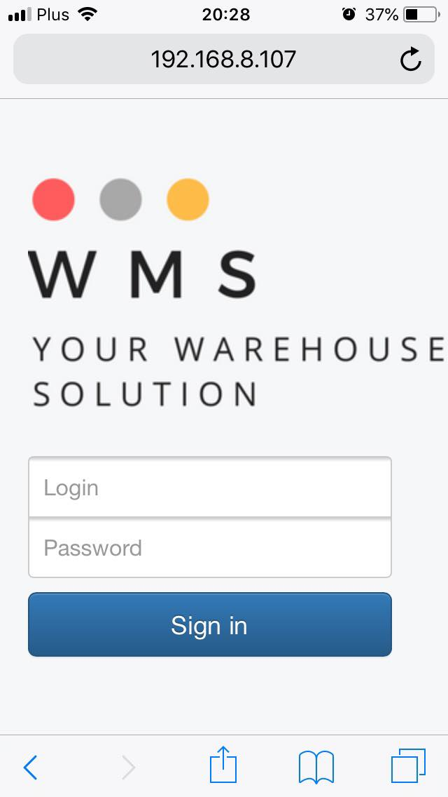
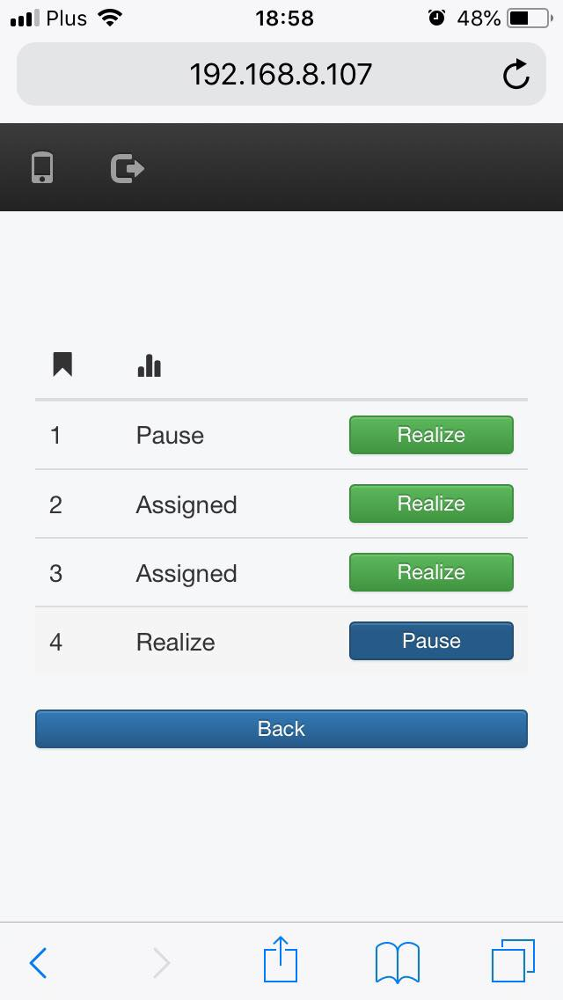
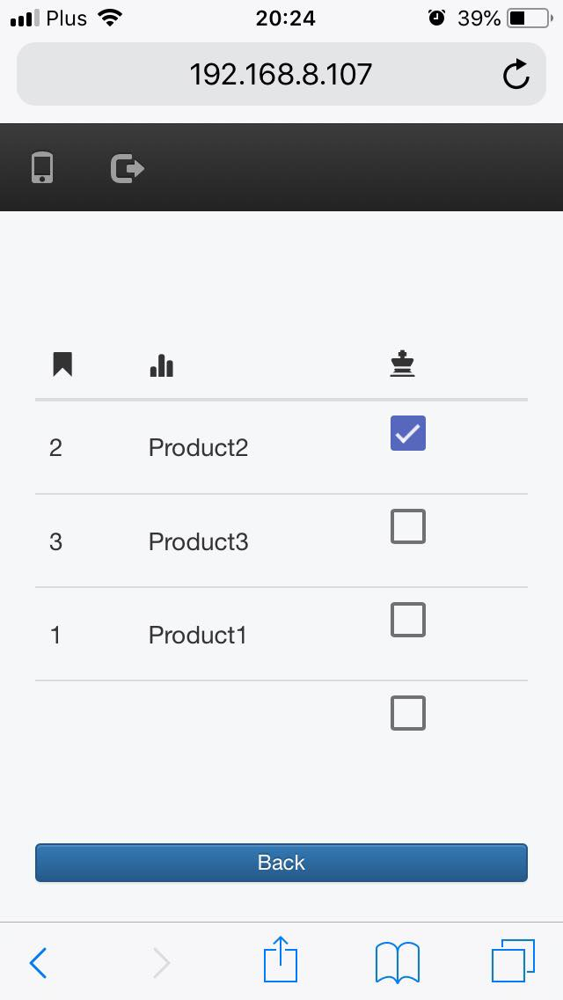
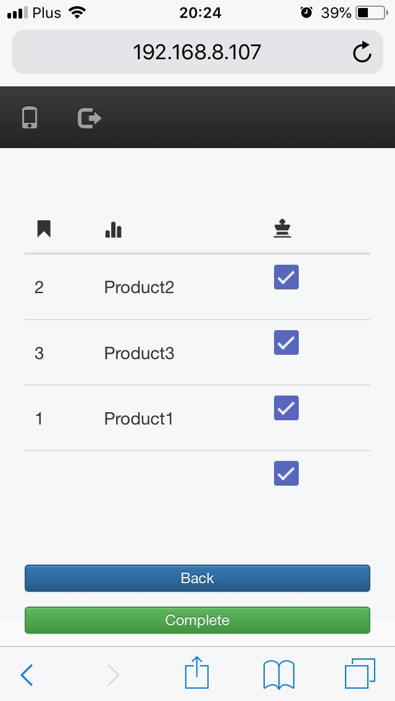

# Warehouse Managment System
Warehouse Management System - bachelor's thesis

## About
This is my example implementation of Warehouse Management System. This solution is based on Spring Boot, Spring Security and AngularJS.

## Requirements
This app is built with Maven and Java 1.8. You need MySQL database on port 3306 with name *database_wms*.
You can change it in application.properties.

## Usage
Just start the application with the Spring Boot maven plugin. The application is
running at [http://localhost:8080](http://localhost:8080).

Three steps:
```
git clone https://github.com/LukaszSzetela/wms
Then you have to go to wms direcotry.
mvn spring-boot:run
```
There are five user accounts present to demonstrate the different levels of access and functions.

| Role | Login | Password |
| --- | --- | --- |
| Admin | admin | admin |
| Office | office | office |
| Warehouseman | user | user |
| Customer | customer | customer |
| Customer | customer2 | customer2 |

## Screenshots - web module


## Screenshots - mobile module
 
 

